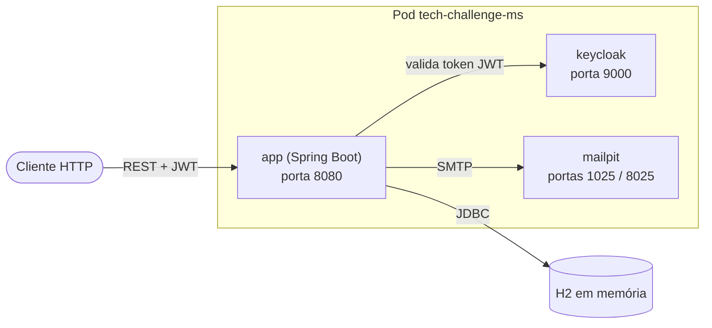
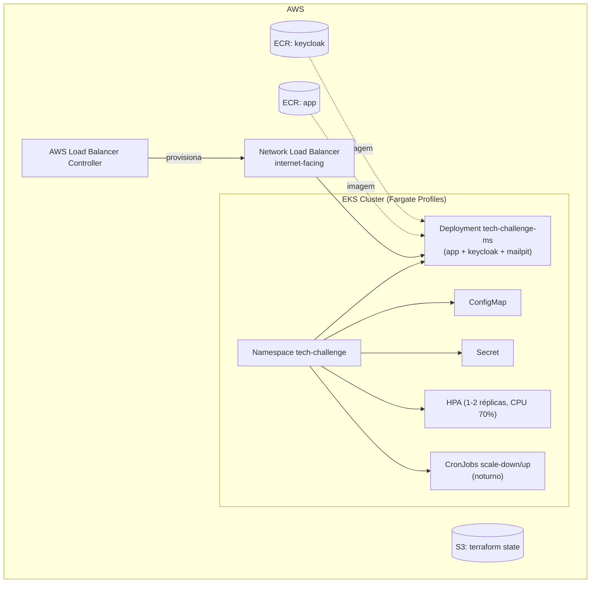
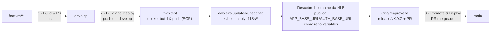

# g52-app-tech-challenge

API de gerenciamento de ordens de serviço para uma oficina automotiva (clientes, veículos, peças, insumos, serviços e ordens de serviço), desenvolvida em Spring Boot pelo Grupo 52 como parte do tech challenge.

## Documentação da API

A especificação Swagger/OpenAPI é mantida no repositório [`doc-api-g52-tech-challenge-v1`](https://github.com/Teplotax/doc-api-g52-tech-challenge-v1) e publicada via **GitHub Pages**:

https://teplotax.github.io/doc-api-g52-tech-challenge-v1/

Também existe uma collection completa das APIs (Postman/Insomnia) cobrindo todos os fluxos da aplicação. Como essa collection inclui credenciais (usuários, client secret do Keycloak, etc.), o link não foi incluído neste README. Ela foi compartilhada apenas no PDF de entrega da Fase 02.

## Descrição da solução e objetivos desta fase

Este repositório contém o **serviço de aplicação** (API + Keycloak + MailPit, empacotados como imagens Docker) e os **manifestos Kubernetes** usados para publicá-lo. Nesta fase o foco foi:

- Migrar o deploy de **ECS Fargate** para um **cluster EKS (Fargate Profiles)**, gerenciado via Kubernetes puro (Deployments, Services, ConfigMaps, Secrets, HPA), em vez de recursos nativos da AWS (Task Definitions, Application Auto Scaling).
- Extrair todo o Terraform de provisionamento de infraestrutura para um repositório dedicado (`g52-infra-eks-tech-challenge`), mantendo neste repositório apenas o código da aplicação e os manifestos que descrevem *como* ela roda dentro do cluster.
- Mover credenciais e segredos sensíveis (senha de e-mail, segredo de aprovação, credenciais do Keycloak) de variáveis de ambiente em texto puro para um `Secret` do Kubernetes, injetado no pod via `envFrom`/`secretKeyRef` e populado em runtime pelo pipeline a partir de GitHub Secrets, nunca commitado com valores reais.
- Manter a paridade entre o ambiente local (Docker Compose) e o ambiente do cluster (Kubernetes), reaproveitando as mesmas imagens e variáveis de configuração.

## Desenho da arquitetura proposta

### Componentes da aplicação

O pod da aplicação roda três containers (app, Keycloak e MailPit) no mesmo `Deployment`, tanto localmente (via `docker-compose.yml`) quanto no cluster (via `k8s/deployment.yaml`):



Camadas internas da API (Clean Architecture): `controller` → `usecase`/`service` → `gateway` (interface + `gateway/impl`) → `gateway/database` (entidades JPA + repositórios), com `dto`s de request/response e `domain` representando as entidades de negócio (`Cliente`, `Veiculo`/`Marca`/`Modelo`, `Peca`, `Insumo`, `Servico`, `OrdemDeServico`, `ApprovalLink`).

### Infraestrutura provisionada

A infraestrutura da AWS é provisionada por Terraform no repositório separado [`g52-infra-eks-tech-challenge`](https://github.com/Teplotax/g52-infra-eks-tech-challenge). Este repositório (`g52-app-tech-challenge`) consome essa infraestrutura, mas não a provisiona:



| Recurso | Provisionado por | Descrição |
|---|---|---|
| Cluster EKS + Fargate Profiles | Terraform (`g52-infra-eks-tech-challenge`) | Compute do cluster, sem nós EC2 gerenciados manualmente |
| Repositórios ECR (app e keycloak) | Terraform (`g52-infra-eks-tech-challenge`) | Imagens Docker publicadas pelo pipeline deste repositório |
| IAM Role (IRSA) + AWS Load Balancer Controller | Terraform (`g52-infra-eks-tech-challenge`) | Cria a NLB a partir do `Service type: LoadBalancer` definido em `k8s/service.yaml` |
| metrics-server | Terraform (`g52-infra-eks-tech-challenge`) | Necessário para o HPA calcular utilização de CPU |
| Namespace, Deployment, ConfigMap, Secret, Service, HPA, CronJobs | kubectl (`k8s/*.yaml`, deste repositório) | Recursos da aplicação em si, aplicados no cluster já provisionado |
| State do Terraform | S3 (`g52-terraform-state-dev-<account-id>`) | Backend remoto configurado via `-backend-config` no pipeline |

### Fluxo de deploy

O fluxo de branches é `feature → develop → release → main`, com um workflow do GitHub Actions por etapa:



1. **1 - Build & PR** (`feature/**` → `develop`): ao dar push numa branch `feature/*`, roda os testes unitários e abre automaticamente um PR pra `develop` (se ainda não existir um aberto).
2. **2 - Build and Deploy** (`develop`): lê as configs do `.pipes.yml`, builda o JAR e as imagens Docker da app e do Keycloak, publica no ECR, autentica no cluster EKS (`aws eks update-kubeconfig`) e aplica os manifestos em `k8s/` via `kubectl` (secrets injetados a partir de GitHub Secrets via `envsubst`). Depois de aplicar, descobre o hostname da NLB, reaplica o `ConfigMap` com a `APP_BASE_URL` real, reinicia o rollout e publica as URLs como *repo variables* (inclusive no repositório do API Gateway). Se `destroy: true` no `.pipes.yml`, os manifestos são removidos em vez de aplicados. Ao final, cria/reaproveita uma branch `release/vX.Y.Z` com PR de `develop` pra ela.
3. **3 - Promote & Deploy** (`release/**` → `main`): quando o PR de `develop` pra `release/*` é mergeado, roda os testes novamente e abre automaticamente o PR de `release/*` pra `main`.

Autenticação com a AWS é via **OIDC** (sem credenciais fixas). O provisionamento da infraestrutura (cluster, ECR, IAM) roda em um pipeline equivalente no repositório `g52-infra-eks-tech-challenge`, de forma independente deste.

## Instruções

### Execução local

A aplicação roda em containers Docker (app, Keycloak para autenticação e MailPit para e-mails) orquestrados via `docker-compose.yml`. Existem três scripts na raiz do projeto para isso. Antes de tudo, dê permissão de execução a eles (necessário apenas uma vez):

```bash
chmod +x build-and-run.sh run.sh stop.sh
```

#### `build-and-run.sh`

Builda as imagens (incluindo a imagem da aplicação, a partir do `Dockerfile.multistage`) e em seguida sobe todos os containers. Use este script na primeira execução ou sempre que tiver alterado o código/dependências da aplicação:

```bash
./build-and-run.sh
```

#### `run.sh`

Sobe os containers já existentes sem rebuildar nada. Use quando não houver alterações no código desde a última build:

```bash
./run.sh
```

Ambos os scripts aceitam os mesmos parâmetros do `docker compose up`. Por exemplo, para rodar em background:

```bash
./run.sh -d
```

#### `stop.sh`

Para e remove os containers (equivalente a `docker compose down`):

```bash
./stop.sh
```

#### Serviços disponíveis após subir a aplicação

| Serviço | URL                              | Descrição |
|---|----------------------------------|---|
| MailPit | http://localhost:8025            | Visualização dos e-mails enviados pela aplicação (ex.: aprovações de ordem de serviço) |
| H2 Console | http://localhost:8081/h2-console | Console do banco em memória (JDBC URL: `jdbc:h2:mem:testdb`, usuário `sa`, sem senha) |
| Keycloak | http://localhost:8180            | Servidor de autenticação (realm `g52`, usuário admin: `admin` / `admin`) |
| API | http://localhost:8081            | Aplicação Spring Boot |

#### MailPit no ambiente dev (EKS)

O MailPit do ambiente dev é acessado através do API Gateway (`g52-api-tech-challenge-v1-ext`), não diretamente pela NLB. A rota `/mailpit` é provisionada em Terraform separadamente do contrato OpenAPI da aplicação, então não aparece na documentação Swagger:

[https://mjsur3jbx5.execute-api.us-east-1.amazonaws.com/dev/mailpit](https://mjsur3jbx5.execute-api.us-east-1.amazonaws.com/dev/mailpit)

O container do MailPit roda com `MP_WEBROOT=dev/mailpit` (`k8s/deployment.yaml`), fazendo a UI e a API dele responderem sob esse prefixo, o mesmo caminho exposto pelo Gateway. Por isso, acessar o MailPit direto pela NLB (porta 8025) exige o mesmo sufixo: `http://<NLB_HOSTNAME>:8025/dev/mailpit/`. O hostname da NLB muda a cada recriação e está sempre publicado na variável de repositório `NLB_HOSTNAME` (aba `Variables` do ambiente `dev`, GitHub Actions).

### Deploy em Kubernetes

Pré-requisitos: um cluster EKS já provisionado (ver seção [Provisionamento da infraestrutura com Terraform](#provisionamento-da-infraestrutura-com-terraform)), `kubectl` e `aws` CLI configurados, e as imagens da app/Keycloak publicadas em um registro acessível pelo cluster (ex.: ECR).

1. Aponte o `kubectl` para o cluster:

   ```bash
   aws eks update-kubeconfig --name <eks_cluster_name> --region <aws_region>
   ```

2. Defina as variáveis usadas pelos manifestos (eles usam `envsubst` para interpolar `${APP_IMAGE}`, `${KEYCLOAK_IMAGE}`, `${APP_BASE_URL}`, `${MAIL_PASSWORD}`, `${APPROVAL_SECRET}`, `${KEYCLOAK_ADMIN_PASSWORD}`, `${KEYCLOAK_CLIENT_ID}` e `${KEYCLOAK_CLIENT_SECRET}`):

   ```bash
   export APP_IMAGE=<registry>/<ecr_repository>:<tag>
   export KEYCLOAK_IMAGE=<registry>/<ecr_repository_keycloak>:<tag>
   export APP_BASE_URL=http://localhost:8081   # atualizado depois com o hostname real da NLB
   export MAIL_PASSWORD=...
   export APPROVAL_SECRET=...
   export KEYCLOAK_ADMIN_PASSWORD=...
   export KEYCLOAK_CLIENT_ID=...
   export KEYCLOAK_CLIENT_SECRET=...
   ```

   Em CI, esses valores não ficam hardcoded em lugar nenhum do repositório: `APP_IMAGE`/`KEYCLOAK_IMAGE` são resolvidos a partir do `.pipes.yml` e da tag de imagem gerada no pipeline, e os demais (`MAIL_PASSWORD`, `APPROVAL_SECRET`, `KEYCLOAK_ADMIN_PASSWORD`, `KEYCLOAK_CLIENT_ID`, `KEYCLOAK_CLIENT_SECRET`) vêm dos **GitHub Secrets** do ambiente `dev` deste repositório (`Settings → Environments → dev → Environment secrets`). Para rodar esse passo manualmente fora do pipeline, defina esses mesmos valores localmente (ex.: exportando-os a partir de um cofre próprio), sem copiar os valores reais para arquivos versionados.

3. Renderize e aplique os manifestos, na ordem (namespace e secret precisam existir antes do deployment):

   ```bash
   mkdir -p k8s-rendered
   for f in k8s/namespace.yaml k8s/configmap.yaml k8s/secret.yaml k8s/deployment.yaml k8s/service.yaml k8s/hpa.yaml; do
     envsubst < "$f" > "k8s-rendered/$(basename "$f")"
   done

   kubectl apply -f k8s-rendered/namespace.yaml
   kubectl apply -f k8s-rendered/configmap.yaml
   kubectl apply -f k8s-rendered/secret.yaml
   kubectl apply -f k8s-rendered/deployment.yaml
   kubectl apply -f k8s-rendered/service.yaml
   kubectl apply -f k8s-rendered/hpa.yaml

   kubectl rollout status deployment/tech-challenge-ms -n tech-challenge --timeout=300s
   ```

4. Opcionalmente, aplique também as `CronJob`s de scale down/up noturno:

   ```bash
   kubectl apply -f k8s/scale-schedule.yaml
   ```

5. Descubra o hostname público da NLB provisionada pelo AWS Load Balancer Controller, atualize `APP_BASE_URL`/`KEYCLOAK_JWK_SET_URI` no `ConfigMap` e reinicie o rollout:

   ```bash
   kubectl get svc tech-challenge-nlb -n tech-challenge -o jsonpath='{.status.loadBalancer.ingress[0].hostname}'

   export APP_BASE_URL=http://<hostname-da-nlb>:8080
   envsubst < k8s/configmap.yaml > k8s-rendered/configmap.yaml
   kubectl apply -f k8s-rendered/configmap.yaml
   kubectl rollout restart deployment/tech-challenge-ms -n tech-challenge
   ```

Para desfazer o deploy (remover apenas os recursos da aplicação, sem tocar no cluster):

```bash
kubectl delete -f k8s/hpa.yaml -f k8s/service.yaml -f k8s/deployment.yaml -f k8s/configmap.yaml -f k8s/secret.yaml --ignore-not-found
```

> Em CI, esse passo a passo (login OIDC na AWS, build/push das imagens, `envsubst`, `kubectl apply`, descoberta do hostname da NLB e publicação das URLs como *repo variables*) é automatizado pelo workflow `2 - [DEV] Build and Deploy` (`.github/workflows/2-dev-to-release.yml`), controlado pelo `.pipes.yml` na raiz deste repositório.

### Provisionamento da infraestrutura com Terraform

O Terraform que provisiona o cluster EKS, os repositórios ECR e os componentes de suporte (AWS Load Balancer Controller, metrics-server) **não vive neste repositório**. Ele está no repositório [`g52-infra-eks-tech-challenge`](https://github.com/Teplotax/g52-infra-eks-tech-challenge), separado para manter a fronteira entre "infraestrutura" e "aplicação". Resumo de como executá-lo:

Pré-requisitos:

- Terraform >= 1.6
- AWS CLI configurado com permissões adequadas
- Bucket S3 para armazenar o state remoto (`g52-terraform-state-dev-<account-id>`)
- Subnets com rota de saída para a internet (NAT Gateway ou VPC Endpoints para `ecr.api`, `ecr.dkr`, `s3`, `sts` e `eks`), já que pods em Fargate não recebem IP público diretamente

Passo a passo (a partir do diretório `infra/` do repositório `g52-infra-eks-tech-challenge`):

```bash
terraform init -reconfigure \
  -backend-config="bucket=g52-terraform-state-dev-<account-id>" \
  -backend-config="key=dev/<cluster_name>/terraform.tfstate" \
  -backend-config="region=us-east-1"

terraform validate

# revisar as mudanças antes de aplicar
terraform plan -var-file=inventories/dev/terraform.tfvars

# provisionar/atualizar a infraestrutura
terraform apply -var-file=inventories/dev/terraform.tfvars

# desprovisionar tudo (equivalente a definir destroy = true no terraform.tfvars)
terraform destroy -var-file=inventories/dev/terraform.tfvars
```

Principais variáveis (`inventories/dev/terraform.tfvars`): `cluster_name`, `kubernetes_version`, `aws_region`, `environment`, `app_namespace`, `subnet_ids`, `console_user_arn` e `destroy` (quando `true`, o pipeline roda `terraform destroy` em vez de `apply`).

Assim como neste repositório, o provisionamento é automatizado por um pipeline próprio (`2 - [DEV] Build and Deploy` em `g52-infra-eks-tech-challenge`), seguindo o mesmo fluxo `feature → develop → release → main` e autenticação via OIDC.

## Stack e arquitetura

- **Java 21** e **Spring Boot**, com Maven como gerenciador de build (`app/pom.xml`)
- **Spring Data JPA** com banco **H2** em memória para o ambiente local/docker
- **Spring Security + OAuth2 Resource Server**, validando JWTs emitidos pelo **Keycloak**
- **Spring Mail**, com **MailPit** como servidor SMTP de desenvolvimento
- Geração de PDF via **openhtmltopdf**
- Observabilidade via **Actuator** e **Micrometer/Prometheus** (`/actuator/health`, `/actuator/prometheus`, etc.)
- Código organizado em camadas seguindo princípios de Clean Architecture: `controller` → `service` → `gateway` (interface + implementação) → `gateway/database` (entidades JPA e repositórios), com `dto`s de request/response e `domain` representando as entidades de negócio

## Recursos da API

- `Cliente`
- `Veiculo` (e `Marca`/`Modelo`)
- `Peca`
- `Insumo`
- `Servico`
- `OrdemDeServico`
- `ApprovalLink` (aprovação de ordens de serviço por link enviado por e-mail)

A especificação completa dos endpoints está disponível no Swagger hospedado no GitHub Pages, linkado no início deste README.

## Configuração

Os perfis de configuração ficam em `app/src/main/resources`:

- `application.yaml`: configurações comuns (porta, mail, OAuth2, actuator)
- `application-local.yaml`: perfil para execução local com H2 em memória
- `application-docker.yaml`: perfil usado pelo container da aplicação no `docker-compose.yml`

Principais variáveis de ambiente usadas no `docker-compose.yml`: `MAIL_HOST`, `MAIL_PORT`, `APPROVAL_SECRET`, `APP_BASE_URL`, `APPROVAL_TTL_MINUTES` e `KEYCLOAK_JWK_SET_URI`. No cluster Kubernetes, a configuração não sensível fica em `k8s/configmap.yaml` e as credenciais (senha de e-mail, segredo de aprovação, credenciais do Keycloak) ficam em `k8s/secret.yaml`, populado em runtime a partir de GitHub Secrets pelo pipeline de deploy.

## Repositórios do projeto

Este repositório contém a **aplicação** (API + Keycloak + MailPit) e os **manifestos Kubernetes** para publicá-la. A solução completa do projeto **G52 | Tech Challenge** está distribuída nos seguintes repositórios:

| Recurso | Tipo     | Link Repositório |
|---|----------|---|
| EKS Cluster + ECR + Load Balancer Controller | Infra    | https://github.com/Teplotax/g52-infra-eks-tech-challenge |
| App + Manifestos K8s | App      | https://github.com/Teplotax/g52-app-tech-challenge |
| API Gateway | Infra    | https://github.com/Teplotax/g52-infra-gateway-tech-challenge |
| API Gateway | Contract | https://github.com/Teplotax/g52-api-tech-challenge-v1-ext |
| API Gateway | Doc      | https://github.com/Teplotax/doc-api-g52-tech-challenge-v1 |

> Fases anteriores do projeto usavam ECS Fargate, com infraestrutura nos repositórios `g52-infra-ecs-tech-challenge` (cluster ECS) e `g52-infra-lb-tech-challenge` (load balancer), hoje substituídos por `g52-infra-eks-tech-challenge`.

## Workflows (GitHub Actions)

Aqui vou precisar me justificar pelo exagero. IaC está no meu plano de desenvolvimento pessoal e não quis perder a chance de exercitar o skill de subir e destruir infra de forma automatizada. Então montei um "esqueleto" de pipeline pra orquestrar build, deploy e PRs automáticas entre as branches. Não está otimizado, tem bastante o que melhorar, mas como ficou fora do escopo dos entregáveis assumi que poderia ter alguns débitos técnicos por aqui.

O fluxo de branches é `feature → develop → release → main`, e cada etapa tem seu próprio workflow (ver detalhes em [Fluxo de deploy](#fluxo-de-deploy)):

- **1 - Build & PR** (`feature/**` → `develop`): ao dar push numa branch `feature/*`, abre automaticamente um PR pra `develop` (se ainda não existir um aberto).
- **2 - Build and Deploy** (`develop`): o mais "pesado". Lê configs do `.pipes.yml`, builda o JAR, builda e sobe as imagens Docker pra ECR, autentica no cluster EKS, aplica os manifestos em `k8s/` via `kubectl` (ou os remove, se `destroy: true`) e, no final, cria/reaproveita uma branch `release/vX.Y.Z` com PR de `develop` pra ela.
- **3 - Promote & Deploy** (`release/**` → `main`): quando o PR de `develop` pra `release/*` é mergeado, abre automaticamente o PR de `release/*` pra `main`.

Autenticação com a AWS é via OIDC (sem credenciais fixas).
