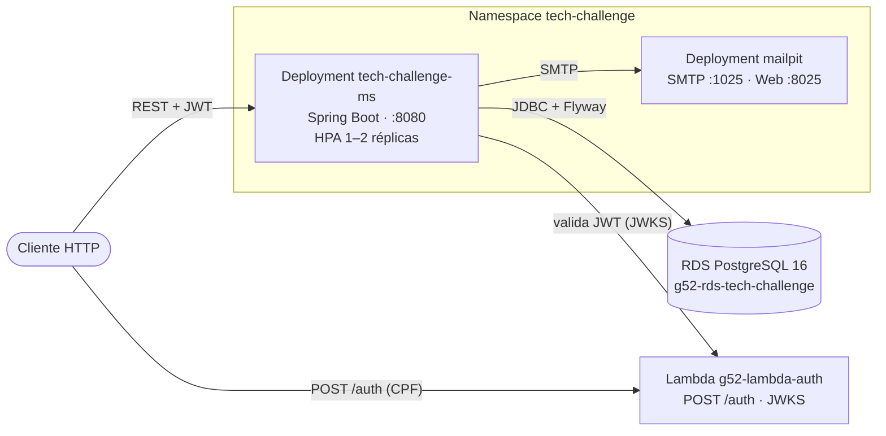
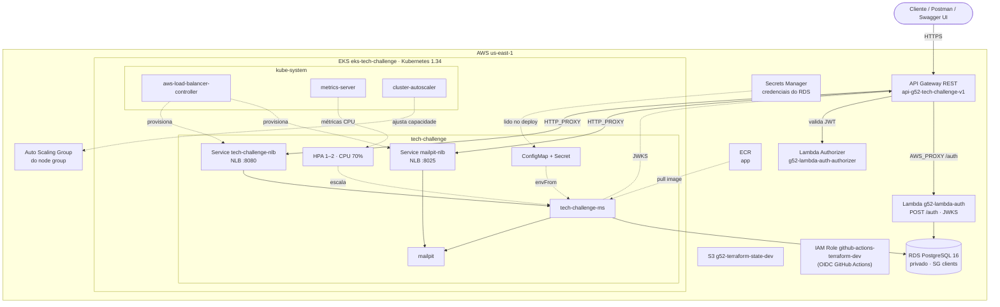
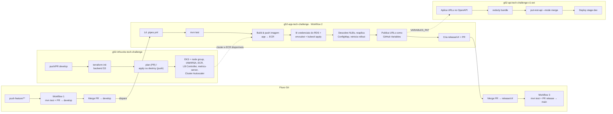

# g52-app-tech-challenge

API de gerenciamento de ordens de serviço para uma oficina automotiva (clientes, veículos, peças, insumos, serviços e ordens de serviço), desenvolvida em Spring Boot pelo Grupo 52 como parte do tech challenge.

## Documentação da API

A especificação Swagger/OpenAPI é mantida no repositório [`doc-api-g52-tech-challenge-v1`](https://github.com/Teplotax/doc-api-g52-tech-challenge-v1) e publicada via **GitHub Pages**:

https://teplotax.github.io/doc-api-g52-tech-challenge-v1/

Também existe uma collection completa das APIs (Postman/Insomnia) cobrindo todos os fluxos da aplicação. Como essa collection inclui dados de clientes de teste (CPFs do seed), o link não foi incluído neste README. Ela é compartilhada apenas no PDF de entrega.

## Descrição da solução e objetivos desta fase

Este repositório contém o **serviço de aplicação** (API + MailPit, empacotados como imagens Docker) e os **manifestos Kubernetes** usados para publicá-lo. Nesta fase o foco foi:

- Migrar o deploy de **ECS Fargate** para um **cluster EKS (Fargate Profiles)**, gerenciado via Kubernetes puro (Deployments, Services, ConfigMaps, Secrets, HPA), em vez de recursos nativos da AWS (Task Definitions, Application Auto Scaling).
- Extrair todo o Terraform de provisionamento de infraestrutura para um repositório dedicado (`g52-infra-eks-tech-challenge`), mantendo neste repositório apenas o código da aplicação e os manifestos que descrevem *como* ela roda dentro do cluster.
- Mover credenciais e segredos sensíveis (senha de e-mail, segredo de aprovação, senha do banco) de variáveis de ambiente em texto puro para um `Secret` do Kubernetes, injetado no pod via `envFrom`/`secretKeyRef` e populado em runtime pelo pipeline a partir de GitHub Secrets, nunca commitado com valores reais.
- Manter a paridade entre o ambiente local (Docker Compose) e o ambiente do cluster (Kubernetes), reaproveitando as mesmas imagens e variáveis de configuração.

## Desenho da arquitetura proposta

### Componentes da aplicação

App e MailPit rodam como `Deployment`s independentes (cada um com seu próprio Pod, réplicas e Service), tanto localmente (via `docker-compose.yml`) quanto no cluster (`k8s/deployment.yaml`, `k8s/mailpit.yaml`) — o HPA escala só o Deployment da app. O banco é um **RDS PostgreSQL 16** gerenciado, fora do cluster (repositório [`g52-infra-rds-tech-challenge`](https://github.com/Teplotax/g52-infra-rds-tech-challenge)). A app alcança o banco porque os nós do EKS anexam o SG `g52-rds-tech-challenge-clients`.

A autenticação fica fora do cluster, na Function Serverless do repositório [`g52-lambda-tech-challenge`](https://github.com/Teplotax/g52-lambda-tech-challenge). Ela emite dois tipos de JWT (RS256), diferenciados pela claim `roles`:

- **Cliente** (`POST /auth` com o CPF, `roles: CLIENTE`): só consulta e aprova as **próprias** OS (`GET /ordensDeServico`, `GET /ordensDeServico/{osId}` e `POST /ordensDeServico/{osId}/aprovar`). A listagem é filtrada pelo CPF do token. Uma OS de outro cliente responde `404`.
- **Administrativo** (`POST /auth/token` com `client_credentials`, `roles: ADMIN`): todas as rotas, para a equipe da oficina.

O **Lambda Authorizer** valida o token e a role no API Gateway. A app valida de novo pelo JWKS publicado pela Lambda (`JWT_JWK_SET_URI`), conferindo assinatura, expiração, emissor e audiência, e aplica as mesmas regras de role no `SecurityConfig`. Os links enviados por e-mail (`/aprovacao/**` e `/aquisicao/**`) continuam públicos, protegidos por token HMAC:


```mermaid
flowchart LR
    client(["Cliente HTTP"])

    subgraph ns["Namespace tech-challenge"]
        app["Deployment tech-challenge-ms<br/>Spring Boot · :8080<br/>HPA 1–2 réplicas"]
        mp["Deployment mailpit<br/>SMTP :1025 · Web :8025"]
    end

    pg[("RDS PostgreSQL 16<br/>g52-rds-tech-challenge")]

    lambda["Lambda g52-lambda-auth<br/>POST /auth · JWKS"]

    client -- "POST /auth (CPF)" --> lambda
    client -- "REST + JWT" --> app
    app -- "valida JWT (JWKS)" --> lambda
    app -- "SMTP" --> mp
    app -- "JDBC + Flyway" --> pg
```

Camadas internas da API (Clean Architecture): `controller` → `usecase`/`service` → `gateway` (interface + `gateway/impl`) → `gateway/database` (entidades JPA + repositórios), com `dto`s de request/response e `domain` representando as entidades de negócio (`Cliente`, `Veiculo`/`Marca`/`Modelo`, `Peca`, `Insumo`, `Servico`, `OrdemDeServico`, `ApprovalLink`).

### Infraestrutura provisionada

A infraestrutura da AWS é provisionada por Terraform no repositório separado [`g52-infra-eks-tech-challenge`](https://github.com/Teplotax/g52-infra-eks-tech-challenge). Este repositório (`g52-app-tech-challenge`) consome essa infraestrutura, mas não a provisiona:


```mermaid
flowchart TB
    client(["Cliente / Postman / Swagger UI"])

    subgraph aws["AWS us-east-1"]
        apigw["API Gateway REST<br/>api-g52-tech-challenge-v1"]
        authz["Lambda Authorizer<br/>g52-lambda-auth-authorizer"]
        auth["Lambda g52-lambda-auth<br/>POST /auth · JWKS"]

        subgraph eks["EKS eks-tech-challenge · Kubernetes 1.34<br/>Managed node group t3.small (2–3 nós)"]
            subgraph sys["kube-system"]
                lbc["aws-load-balancer-controller"]
                ms["metrics-server"]
                ca["cluster-autoscaler"]
            end

            subgraph ns["tech-challenge"]
                nlbApp["Service tech-challenge-nlb<br/>NLB :8080"]
                nlbMp["Service mailpit-nlb<br/>NLB :8025"]
                app["tech-challenge-ms"]
                mp["mailpit"]
                hpa["HPA 1–2 · CPU 70%"]
                cfg["ConfigMap + Secret"]
            end
        end

        ecr["ECR<br/>app"]
        pg[("RDS PostgreSQL 16<br/>privado · SG clients")]
        sm["Secrets Manager<br/>credenciais do RDS"]
        asg["Auto Scaling Group<br/>do node group"]
        s3["S3 g52-terraform-state-dev"]
        iam["IAM Role github-actions-terraform-dev<br/>(OIDC GitHub Actions)"]
    end

    client -- HTTPS --> apigw
    apigw -- "valida JWT" --> authz
    apigw -- "AWS_PROXY /auth" --> auth
    apigw -- "HTTP_PROXY" --> nlbApp & nlbMp
    nlbApp --> app
    nlbMp --> mp
    app --> mp & pg
    app -. "JWKS" .-> apigw
    cfg -. envFrom .-> app
    auth --> pg
    sm -. "lido no deploy" .-> cfg
    hpa -. escala .-> app
    ms -. métricas CPU .-> hpa
    lbc -. provisiona .-> nlbApp & nlbMp
    ca -. ajusta capacidade .-> asg
    ecr -. pull image .-> app
```

| Recurso | Provisionado por | Descrição |
|---|---|---|
| Cluster EKS + managed node group (`t3.small`, 2–3 nós) | Terraform (`g52-infra-eks-tech-challenge`) | Compute do cluster |
| Repositório ECR da app | Terraform (`g52-infra-eks-tech-challenge`) | Imagens Docker publicadas pelo pipeline deste repositório |
| IAM Role (IRSA) + AWS Load Balancer Controller | Terraform (`g52-infra-eks-tech-challenge`) | Cria uma NLB para cada `Service type: LoadBalancer` (`k8s/service.yaml`, `k8s/mailpit.yaml`) — uma NLB por componente, já que cada um é um Deployment/Pod independente |
| metrics-server | Terraform (`g52-infra-eks-tech-challenge`) | Necessário para o HPA calcular utilização de CPU |
| IAM Role (IRSA) + Cluster Autoscaler | Terraform (`g52-infra-eks-tech-challenge`) | Adiciona/remove nós do node group quando há pods `Pending` (ex: 2ª réplica do HPA) |
| Namespace, Deployments (app/MailPit), ConfigMap, Secret, Services, HPA | kubectl (`k8s/*.yaml`, deste repositório) | Recursos da aplicação em si, aplicados no cluster já provisionado |
| RDS PostgreSQL 16 + SG de clientes + secret de credenciais | Terraform (`g52-infra-rds-tech-challenge`) | Banco de dados gerenciado da aplicação e da Lambda de autenticação |
| Lambda de autenticação por CPF + Lambda Authorizer | Terraform (`g52-lambda-tech-challenge`) | Emissão e validação dos JWT usados pelas rotas protegidas |
| State do Terraform | S3 (`g52-terraform-state-dev-<account-id>`) | Backend remoto configurado via `-backend-config` no pipeline |

### Fluxo de deploy

O fluxo de branches é `feature → develop → release → main`, com um workflow do GitHub Actions por etapa:


```mermaid
flowchart LR
    subgraph git["Fluxo Git"]
        direction LR
        f["push feature/**"] --> w1["Workflow 1<br/>mvn test + PR → develop"]
        w1 --> md["Merge PR → develop"]
        mr["Merge PR → release/vX"] --> w3["Workflow 3<br/>mvn test + PR release → main"]
    end

    subgraph infra["g52-infra-eks-tech-challenge"]
        direction LR
        i1["push/PR develop"] --> i2["terraform init<br/>backend S3"]
        i2 --> i3["plan (PR) /<br/>apply ou destroy (push)"]
        i3 --> i4["EKS + node group, IAM/IRSA, ECR,<br/>LB Controller, metrics-server,<br/>Cluster Autoscaler"]
    end

    subgraph app["g52-app-tech-challenge · Workflow 2"]
        direction LR
        a1["Lê .pipes.yml"] --> a2["mvn test"]
        a2 --> a3["Build & push imagem<br/>app → ECR"]
        a3 --> a4["lê credenciais do RDS +<br/>envsubst + kubectl apply"]
        a4 --> a5["Descobre NLBs, reaplica<br/>ConfigMap, reinicia rollout"]
        a5 --> a6["Publica URLs como<br/>GitHub Variables"]
        a6 --> a7["Cria release/vX + PR"]
    end

    subgraph ext["g52-api-tech-challenge-v1-ext"]
        direction LR
        e1["Aplica URLs no OpenAPI"] --> e2["redocly bundle"]
        e2 --> e3["put-rest-api --mode merge"]
        e3 --> e4["Deploy stage dev"]
    end

    md -- dispara --> a1
    i4 -. "cluster e ECR disponíveis" .-> a3
    a6 -. "VARIABLES_PAT" .-> e1
    a7 --> mr
```

1. **1 - Build & PR** (`feature/**` → `develop`): ao dar push numa branch `feature/*`, roda os testes unitários e abre automaticamente um PR pra `develop` (se ainda não existir um aberto).
2. **2 - Build and Deploy** (`develop`): lê as configs do `.pipes.yml`, builda o JAR e a imagem Docker da app, publica no ECR, autentica no cluster EKS (`aws eks update-kubeconfig`) e aplica os manifestos em `k8s/` via `kubectl` (credenciais do RDS lidas do Secrets Manager e demais secrets a partir de GitHub Secrets, injetados via `envsubst`). Depois de aplicar, descobre o hostname das NLBs (app e MailPit), reaplica o `ConfigMap` com a `APP_BASE_URL` real, reinicia o rollout da app e publica as URLs como *repo variables* (inclusive no repositório do API Gateway). Se `destroy: true` no `.pipes.yml`, os manifestos são removidos em vez de aplicados. Ao final, cria/reaproveita uma branch `release/vX.Y.Z` com PR de `develop` pra ela.
3. **3 - Promote & Deploy** (`release/**` → `main`): quando o PR de `develop` pra `release/*` é mergeado, roda os testes novamente e abre automaticamente o PR de `release/*` pra `main`.

Autenticação com a AWS é via **OIDC** (sem credenciais fixas). O provisionamento da infraestrutura (cluster, ECR, IAM) roda em um pipeline equivalente no repositório `g52-infra-eks-tech-challenge`, de forma independente deste.

## Instruções

### Execução local

Localmente, a aplicação roda em containers Docker (app, Postgres e MailPit para e-mails) orquestrados via `docker-compose.yml`. Localmente a autenticação fica **desligada** (`AUTH_ENABLED=false` no `docker-compose.yml` e `app.security.enabled: false` no profile `local`), então as rotas respondem sem token. Existem três scripts na raiz do projeto para isso. Antes de tudo, dê permissão de execução a eles (necessário apenas uma vez):

```bash
chmod +x build-and-run.sh run.sh stop.sh
```

#### `build-and-run.sh`

Builda as imagens (incluindo a imagem da aplicação, a partir do `Dockerfile.multistage`) e em seguida sobe todos os containers. Use este script na primeira execução ou sempre que tiver alterado o código/dependências da aplicação:

```bash
./build-and-run.sh
```

#### `run.sh`

Sobe os containers já existentes sem rebuildar nada. Use quando não houver alterações no código desde a última build:

```bash
./run.sh
```

Ambos os scripts aceitam os mesmos parâmetros do `docker compose up`. Por exemplo, para rodar em background:

```bash
./run.sh -d
```

#### `stop.sh`

Para e remove os containers (equivalente a `docker compose down`):

```bash
./stop.sh
```

#### Serviços disponíveis após subir a aplicação

| Serviço | URL                              | Descrição |
|---|----------------------------------|---|
| MailPit | http://localhost:8025            | Visualização dos e-mails enviados pela aplicação (ex.: aprovações de ordem de serviço) |
| Postgres | localhost:5432                   | Banco de dados (database `techchallenge`, usuário/senha `techchallenge`) |
| API | http://localhost:8081            | Aplicação Spring Boot |

#### MailPit no ambiente dev (EKS)

O MailPit do ambiente dev é acessado através do API Gateway (`g52-api-tech-challenge-v1-ext`), não diretamente pela NLB. A rota `/mailpit` é provisionada em Terraform separadamente do contrato OpenAPI da aplicação, então não aparece na documentação Swagger:

[https://uqjslc5lb8.execute-api.us-east-1.amazonaws.com/dev/mailpit](https://uqjslc5lb8.execute-api.us-east-1.amazonaws.com/dev/mailpit)

O container do MailPit roda com `MP_WEBROOT=dev/mailpit` (`k8s/mailpit.yaml`), fazendo a UI e a API dele responderem sob esse prefixo, o mesmo caminho exposto pelo Gateway. Por isso, acessar o MailPit direto pela sua NLB (porta 8025) exige o mesmo sufixo: `http://<MAILPIT_HOSTNAME>:8025/dev/mailpit/`. O hostname muda a cada recriação e está sempre publicado na variável de repositório `MAILPIT_HOSTNAME` (aba `Variables` do ambiente `dev`, GitHub Actions) — cada componente (app, MailPit) tem sua própria NLB e sua própria variável de hostname (`APP_HOSTNAME`, `MAILPIT_HOSTNAME`).

### Deploy em Kubernetes

Pré-requisitos: um cluster EKS já provisionado (ver seção [Provisionamento da infraestrutura com Terraform](#provisionamento-da-infraestrutura-com-terraform)), `kubectl` e `aws` CLI configurados, e a imagem da app publicada em um registro acessível pelo cluster (ex.: ECR).

1. Aponte o `kubectl` para o cluster:

   ```bash
   aws eks update-kubeconfig --name <eks_cluster_name> --region <aws_region>
   ```

2. Defina as variáveis usadas pelos manifestos (eles usam `envsubst` para interpolar `${APP_IMAGE}`, `${APP_BASE_URL}`, `${MAIL_PASSWORD}`, `${APPROVAL_SECRET}`, `${JWT_JWK_SET_URI}` e `${DB_HOST}`/`${DB_PORT}`/`${DB_NAME}`/`${DB_USERNAME}`/`${DB_PASSWORD}`):

   ```bash
   export APP_IMAGE=<registry>/<ecr_repository>:<tag>
   export APP_BASE_URL=http://localhost:8081   # atualizado depois com o hostname real da NLB da app
   export MAIL_PASSWORD=...
   export APPROVAL_SECRET=...
   export JWT_JWK_SET_URI=https://<api-id>.execute-api.us-east-1.amazonaws.com/dev/.well-known/jwks.json
   # credenciais do RDS
   SECRET=$(aws secretsmanager get-secret-value --secret-id g52-rds-tech-challenge/credentials --query SecretString --output text)
   export DB_HOST=$(echo "$SECRET" | jq -r .host) DB_PORT=$(echo "$SECRET" | jq -r .port) DB_NAME=$(echo "$SECRET" | jq -r .dbname)
   export DB_USERNAME=$(echo "$SECRET" | jq -r .username) DB_PASSWORD=$(echo "$SECRET" | jq -r .password)
   ```

   Em CI, esses valores não ficam hardcoded em lugar nenhum do repositório: `APP_IMAGE` e `JWT_JWK_SET_URI` são resolvidos a partir do `.pipes.yml` (e da tag de imagem gerada no pipeline), as credenciais do banco vêm do secret do RDS (`db_secret_name` no `.pipes.yml`), e os demais (`MAIL_PASSWORD`, `APPROVAL_SECRET`) vêm dos **GitHub Secrets** do ambiente `dev` deste repositório (`Settings → Environments → dev → Environment secrets`). Para rodar esse passo manualmente fora do pipeline, defina esses mesmos valores localmente (ex.: exportando-os a partir de um cofre próprio), sem copiar os valores reais para arquivos versionados.

3. Renderize e aplique os manifestos. O `Deployment` da app tem um `initContainer` que espera o RDS responder na porta 5432; o MailPit é independente da app:

   ```bash
   mkdir -p k8s-rendered
   for f in k8s/namespace.yaml k8s/configmap.yaml k8s/secret.yaml k8s/deployment.yaml k8s/service.yaml k8s/mailpit.yaml k8s/hpa.yaml; do
     envsubst < "$f" > "k8s-rendered/$(basename "$f")"
   done

   kubectl apply -f k8s-rendered/namespace.yaml
   kubectl apply -f k8s-rendered/configmap.yaml
   kubectl apply -f k8s-rendered/secret.yaml
   kubectl apply -f k8s-rendered/deployment.yaml
   kubectl apply -f k8s-rendered/service.yaml
   kubectl apply -f k8s-rendered/mailpit.yaml
   kubectl apply -f k8s-rendered/hpa.yaml

   kubectl rollout status deployment/tech-challenge-ms -n tech-challenge --timeout=300s
   kubectl rollout status deployment/mailpit -n tech-challenge --timeout=300s
   ```

4. Descubra o hostname público de cada NLB (app e MailPit — cada componente tem a sua), atualize `APP_BASE_URL` no `ConfigMap` e reinicie o rollout da app:

   ```bash
   kubectl get svc tech-challenge-nlb -n tech-challenge -o jsonpath='{.status.loadBalancer.ingress[0].hostname}'  # app
   kubectl get svc mailpit-nlb -n tech-challenge -o jsonpath='{.status.loadBalancer.ingress[0].hostname}'         # mailpit (UI)

   export APP_BASE_URL=http://<hostname-da-nlb-da-app>:8080
   envsubst < k8s/configmap.yaml > k8s-rendered/configmap.yaml
   kubectl apply -f k8s-rendered/configmap.yaml
   kubectl rollout restart deployment/tech-challenge-ms -n tech-challenge
   ```

   `MAIL_HOST` (`mailpit`) já aponta para o nome interno do Service no `ConfigMap`. `JWT_JWK_SET_URI` aponta para o JWKS da Lambda exposto pelo API Gateway; o Spring só busca a chave na primeira validação de token, então a app sobe mesmo que o Gateway ainda não esteja disponível.

Para desfazer o deploy (remover apenas os recursos da aplicação, sem tocar no cluster nem no RDS):

```bash
kubectl delete -f k8s/hpa.yaml -f k8s/service.yaml -f k8s/deployment.yaml -f k8s/mailpit.yaml -f k8s/configmap.yaml -f k8s/secret.yaml --ignore-not-found
```

> Em CI, esse passo a passo (login OIDC na AWS, build/push das imagens, `envsubst`, `kubectl apply`, descoberta do hostname da NLB e publicação das URLs como *repo variables*) é automatizado pelo workflow `2 - [DEV] Build and Deploy` (`.github/workflows/2-dev-to-release.yml`), controlado pelo `.pipes.yml` na raiz deste repositório.

### Provisionamento da infraestrutura com Terraform

O Terraform que provisiona o cluster EKS, os repositórios ECR e os componentes de suporte (AWS Load Balancer Controller, metrics-server) **não vive neste repositório**. Ele está no repositório [`g52-infra-eks-tech-challenge`](https://github.com/Teplotax/g52-infra-eks-tech-challenge), separado para manter a fronteira entre "infraestrutura" e "aplicação". Resumo de como executá-lo:

Pré-requisitos:

- Terraform >= 1.6
- AWS CLI configurado com permissões adequadas
- Bucket S3 para armazenar o state remoto (`g52-terraform-state-dev-<account-id>`)
- Subnets com rota de saída para a internet (NAT Gateway ou VPC Endpoints para `ecr.api`, `ecr.dkr`, `s3`, `sts` e `eks`), já que pods em Fargate não recebem IP público diretamente

Passo a passo (a partir do diretório `infra/` do repositório `g52-infra-eks-tech-challenge`):

```bash
terraform init -reconfigure \
  -backend-config="bucket=g52-terraform-state-dev-<account-id>" \
  -backend-config="key=dev/<cluster_name>/terraform.tfstate" \
  -backend-config="region=us-east-1"

terraform validate

# revisar as mudanças antes de aplicar
terraform plan -var-file=inventories/dev/terraform.tfvars

# provisionar/atualizar a infraestrutura
terraform apply -var-file=inventories/dev/terraform.tfvars

# desprovisionar tudo (equivalente a definir destroy = true no terraform.tfvars)
terraform destroy -var-file=inventories/dev/terraform.tfvars
```

Principais variáveis (`inventories/dev/terraform.tfvars`): `cluster_name`, `kubernetes_version`, `aws_region`, `environment`, `app_namespace`, `subnet_ids`, `console_user_arn` e `destroy` (quando `true`, o pipeline roda `terraform destroy` em vez de `apply`).

Assim como neste repositório, o provisionamento é automatizado por um pipeline próprio (`2 - [DEV] Build and Deploy` em `g52-infra-eks-tech-challenge`), seguindo o mesmo fluxo `feature → develop → release → main` e autenticação via OIDC.

## Stack e arquitetura

- **Java 21** e **Spring Boot**, com Maven como gerenciador de build (`app/pom.xml`)
- **Spring Data JPA** com banco **PostgreSQL** (container `postgres` no `docker-compose.yml` localmente, **Amazon RDS** no ambiente da AWS), schema e dados de exemplo versionados via **Flyway** — o H2 em memória segue sendo usado apenas pelos testes automatizados
- **Spring Security + OAuth2 Resource Server**, validando os JWTs emitidos pela **Lambda de autenticação** (JWKS, emissor `g52-lambda-auth`, audiência `tech-challenge-api`), com autorização por role (`ADMIN` / `CLIENTE`)
- **Spring Mail**, com **MailPit** como servidor SMTP de desenvolvimento
- Geração de PDF via **openhtmltopdf**
- Observabilidade via **Actuator** e **Micrometer/Prometheus** (`/actuator/health`, `/actuator/prometheus`, etc.)
- Código organizado em camadas seguindo princípios de Clean Architecture: `controller` → `service` → `gateway` (interface + implementação) → `gateway/database` (entidades JPA e repositórios), com `dto`s de request/response e `domain` representando as entidades de negócio

## Recursos da API

- `Cliente`
- `Veiculo` (e `Marca`/`Modelo`)
- `Peca`
- `Insumo`
- `Servico`
- `OrdemDeServico`
- `ApprovalLink` (aprovação de ordens de serviço por link enviado por e-mail)

A especificação completa dos endpoints está disponível no Swagger hospedado no GitHub Pages, linkado no início deste README.

## Configuração

Os perfis de configuração ficam em `app/src/main/resources`:

- `application.yaml`: configurações comuns (porta, mail, autenticação JWT em `app.security.*`, actuator); sem `datasource` configurado, então os testes automatizados usam H2 em memória (auto-configurado pelo Spring Boot)
- `application-local.yaml`: perfil para execução local do jar fora de container, apontando para o Postgres publicado em `localhost:5432` pelo `docker-compose.yml`, com a autenticação desligada
- `application-docker.yaml`: perfil usado tanto pelo container da aplicação no `docker-compose.yml` quanto pelo `Deployment` no cluster EKS (no cluster, `DB_HOST` aponta para o endpoint do RDS)

Ambos os perfis não-teste (`local` e `docker`) usam Postgres, com o schema e os dados de exemplo geridos por **Flyway** (`app/src/main/resources/db/migration/`) em vez de `hibernate.ddl-auto` ou `data.sql`:

- `V1__create_schema.sql`: DDL de todas as tabelas (equivalente ao schema que o Hibernate criava automaticamente antes)
- `V2__seed_data.sql`: dados de exemplo (marcas, modelos, clientes, veículos, peças/insumos, serviços) — mesmo conteúdo que existia em `data.sql`
- `V3__revisao_modelo.sql`: revisão do modelo na Fase 3 — coluna `clientes.ativo` (status usado pela autenticação por CPF), constraints de integridade, índices nas FKs e remoção de índices duplicados

O diagrama ER, a explicação dos relacionamentos e a justificativa da escolha do banco estão em [`g52-infra-rds-tech-challenge/docs/modelo-de-dados.md`](https://github.com/Teplotax/g52-infra-rds-tech-challenge/blob/main/docs/modelo-de-dados.md).

`spring.jpa.hibernate.ddl-auto` é `none` nesses dois perfis (Flyway é o dono exclusivo do schema) e `spring.flyway.enabled` é `true`. Por padrão (`application.yaml`) o Flyway fica **desabilitado**, para nunca rodar contra o H2 embarcado usado quando nenhum profile está ativo. Como o Flyway guarda o histórico de migrações aplicadas (tabela `flyway_schema_history`), cada migração roda uma única vez por banco — reiniciar o pod não tenta reinserir os dados de exemplo nem quebra com erro de chave duplicada.

Principais variáveis de ambiente usadas no `docker-compose.yml`: `DB_HOST`, `DB_PORT`, `DB_NAME`, `DB_USERNAME`, `DB_PASSWORD`, `MAIL_HOST`, `MAIL_PORT`, `APPROVAL_SECRET`, `APP_BASE_URL`, `APPROVAL_TTL_MINUTES` e `AUTH_ENABLED`. No cluster, a validação do JWT usa `JWT_JWK_SET_URI`, `JWT_ISSUER` e `JWT_AUDIENCE`. No cluster Kubernetes, a configuração não sensível (incluindo `DB_HOST`/`DB_PORT`/`DB_NAME`/`DB_USERNAME`) fica em `k8s/configmap.yaml`, com os valores do banco preenchidos pelo pipeline a partir do secret do RDS. As credenciais (senha do banco, senha de e-mail, segredo de aprovação) ficam em `k8s/secret.yaml`, populado em runtime pelo pipeline de deploy.

## Repositórios do projeto

Este repositório contém a **aplicação** (API + MailPit) e os **manifestos Kubernetes** para publicá-la. A solução completa do projeto **G52 | Tech Challenge** está distribuída nos seguintes repositórios:

| Recurso | Tipo     | Link Repositório |
|---|----------|---|
| EKS Cluster + ECR + Load Balancer Controller | Infra    | https://github.com/Teplotax/g52-infra-eks-tech-challenge |
| App + Manifestos K8s | App      | https://github.com/Teplotax/g52-app-tech-challenge |
| Autenticação por CPF (Lambda + Authorizer) | Serverless | https://github.com/Teplotax/g52-lambda-tech-challenge |
| Banco de dados (RDS PostgreSQL) | Infra    | https://github.com/Teplotax/g52-infra-rds-tech-challenge |
| API Gateway | Infra    | https://github.com/Teplotax/g52-infra-gateway-tech-challenge |
| API Gateway | Contract | https://github.com/Teplotax/g52-api-tech-challenge-v1-ext |
| API Gateway | Doc      | https://github.com/Teplotax/doc-api-g52-tech-challenge-v1 |

> Fases anteriores do projeto usavam ECS Fargate, com infraestrutura nos repositórios `g52-infra-ecs-tech-challenge` (cluster ECS) e `g52-infra-lb-tech-challenge` (load balancer), hoje substituídos por `g52-infra-eks-tech-challenge`.

## Workflows (GitHub Actions)

Aqui vou precisar me justificar pelo exagero. IaC está no meu plano de desenvolvimento pessoal e não quis perder a chance de exercitar o skill de subir e destruir infra de forma automatizada. Então montei um "esqueleto" de pipeline pra orquestrar build, deploy e PRs automáticas entre as branches. Não está otimizado, tem bastante o que melhorar, mas como ficou fora do escopo dos entregáveis assumi que poderia ter alguns débitos técnicos por aqui.

O fluxo de branches é `feature → develop → release → main`, e cada etapa tem seu próprio workflow (ver detalhes em [Fluxo de deploy](#fluxo-de-deploy)):

- **1 - Build & PR** (`feature/**` → `develop`): ao dar push numa branch `feature/*`, abre automaticamente um PR pra `develop` (se ainda não existir um aberto).
- **2 - Build and Deploy** (`develop`): o mais "pesado". Lê configs do `.pipes.yml`, builda o JAR, builda e sobe as imagens Docker pra ECR, autentica no cluster EKS, aplica os manifestos em `k8s/` via `kubectl` (ou os remove, se `destroy: true`) e, no final, cria/reaproveita uma branch `release/vX.Y.Z` com PR de `develop` pra ela.
- **3 - Promote & Deploy** (`release/**` → `main`): quando o PR de `develop` pra `release/*` é mergeado, abre automaticamente o PR de `release/*` pra `main`.

Autenticação com a AWS é via OIDC (sem credenciais fixas).
